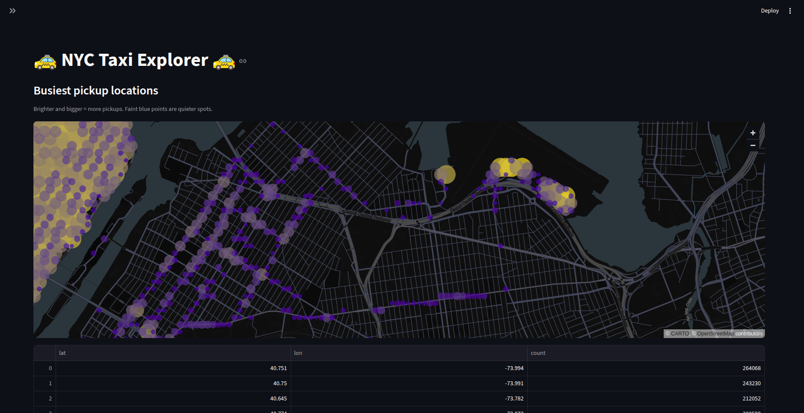
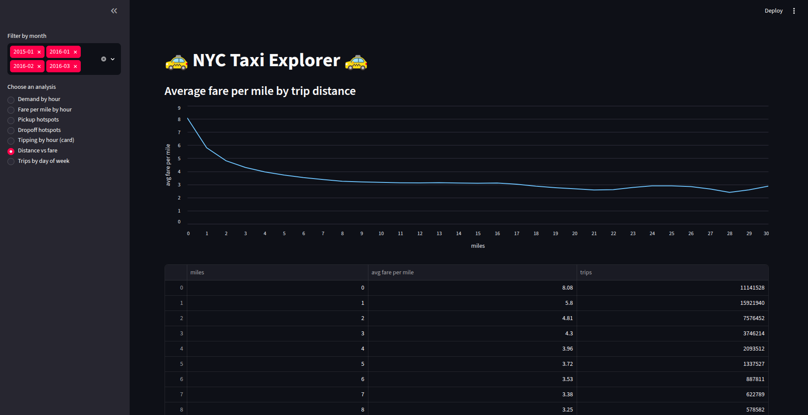

# NYC Taxi Explorer

A big-data analysis app built on **Apache Hadoop (HDFS)**, **PySpark**, and
**Streamlit**, fully containerized with **Docker**. It loads NYC yellow taxi trip
data (2015-2016) into HDFS, processes it with Spark, and serves an interactive
dashboard for browsing the data.

## Architecture

- **HDFS** (namenode + datanode) stores the raw CSVs and the processed Parquet.
- **PySpark** (local mode, inside the app container) reads from HDFS and runs all aggregations.
- **Streamlit** serves the interactive UI on port 8501.
- **Docker Compose** orchestrates the three services on one network.

Data flow: `Kaggle → ./data → HDFS (CSV) → Spark → HDFS (Parquet) → Streamlit`

## Screenshots

### Busiest pickup locations



***

### Average fare per mile by trip distance



## Prerequisites

- Docker (with Docker Compose)
- [uv](https://docs.astral.sh/uv/)

## Setup

```bash
# 1. Clone and enter
git clone https://github.com/aleksanderhanski/hadoop-data-analysis.git
cd hadoop-data-analysis

# 2. Start the cluster (builds the app image; starts HDFS + app)
docker compose up -d

# 3. Wait for HDFS to finish starting up.
#    This BLOCKS until the namenode leaves safe mode and returns as soon as
#    it's ready - so you never start the download before HDFS can accept writes.
docker compose exec namenode hdfs dfsadmin -safemode wait

# 4. Download the dataset and load it into HDFS
uv run download_data.py

# 5. Convert the CSVs to Parquet (one-time)
docker compose exec app python convert_to_parquet.py

# 6. Open the app
#    http://localhost:8501
```

Steps 3-4 take a few minutes - the dataset is ~1.8 GB and the conversion scans all of it once.

## Notes & troubleshooting

- **Step 3 is the wait.** `hdfs dfsadmin -safemode wait` blocks until the namenode
  has finished starting and left safe mode. If you skip it and step 4 fails with
  **"Name node is in safe mode,"** just run step 3 (or force it out with
  `docker compose exec namenode hdfs dfsadmin -safemode leave`) and re-run step 4 -
  the download is cached, so it only re-copies.
- **If step 3 itself errors** with a connection issue, the namenode container is still
  booting up - wait a couple of seconds and re-run step 3.
- **If step 4 or the app dies with `ConnectionRefusedError [Errno 111]`,** the Spark
  JVM ran out of memory and crashed. Both `app/convert_to_parquet.py` and `app/app.py`
  use `.master("local[4]")` - lower the number (e.g. `local[2]` or `local[1]`) in
  **both** files to reduce how many workers run in parallel and the peak memory they use,
  then re-run step 4 and rebuild the app. Fewer workers is slower but uses less memory.
- **Verify the data landed:**
```bash
  docker compose exec namenode hdfs dfs -ls /data                  # raw CSVs
  docker compose exec namenode hdfs dfs -ls /parquet/yellow_taxi   # processed Parquet
```

- **HDFS web UI:** <http://localhost:9870>

## The app

Pick an analysis from the sidebar; the month filter applies to every view.

| View | What it shows |
|------|---------------|
| Demand by hour | Trips per hour of day |
| Fare per mile by hour | Average fare rate by hour |
| Pickup hotspots | Busiest pickup locations, color-graded by frequency |
| Dropoff hotspots | Busiest dropoff locations, color-graded by frequency |
| Tipping by hour (card) | Average tip % by hour (card trips only) |
| Distance vs fare | Average fare per mile by trip distance |
| Trips by day of week | Average trips per weekday |

## Project structure

```
.
├── docker-compose.yml      # HDFS (namenode + datanode) + app services
├── hadoop.env              # HDFS configuration
├── download_data.py        # downloads the dataset and loads it into HDFS
├── data/                   # raw CSVs land here (not committed)
└── app/
    ├── Dockerfile              # Streamlit + PySpark + Java image
    ├── pyproject.toml          # app dependencies (uv)
    ├── uv.lock
    ├── convert_to_parquet.py   # one-time CSV -> Parquet job
    └── app.py                  # the Streamlit dashboard
```

## Data

The dataset is **not committed** (~1.8 GB) - `download_data.py` fetches it on demand.
The `data/` folder is kept in git via `.gitkeep` so it exists on a fresh clone with the
correct ownership.

Dataset: [NYC Yellow Taxi Trip Data](https://www.kaggle.com/datasets/elemento/nyc-yellow-taxi-trip-data)
(Jan 2015 + Jan-Mar 2016). Location is stored as GPS coordinates (this vintage predates
the TLC zone-ID format).